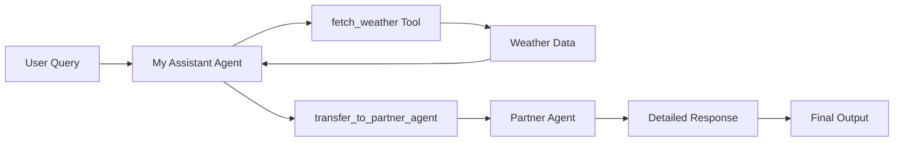

# Agent Handoff Run Output (Detailed Analysis)

Command Executed: `uv run main.py`

---

## 📌 Executive Summary

The agent system executed a **multi-agent handoff workflow** where:

1. **My Assistant** agent fetched weather data for Karachi
2. **Partner Agent** provided detailed weather advice and precautions
3. Final output included comprehensive weather guidance with safety tips

**Final Result:** Cloudy weather in Karachi with detailed precautionary advice.

---

## 🔄 Agent Handoff Flow



---

## 🧭 Step-by-Step Breakdown

### Phase 1: Initial Agent (My Assistant)

#### Step 1: Agent Initialization

```text
Agent My Assistant started.
Usage: requests=0, input_tokens=0, output_tokens=0, total_tokens=0
```

**What's happening:** The first agent boots up with zero usage counters.

#### Step 2: User Query Processing

```json
[{ "content": "give me detail about weather of karachi", "role": "user" }]
```

**What's happening:** User's request is formatted into OpenAI's message format with `role: user`.

#### Step 3: AI Model Response (Function Call)

```json
{
  "output": [
    {
      "arguments": "{\"city\":\"karachi\"}",
      "name": "fetch_weather",
      "type": "function_call",
      "id": "__fake_id__"
    }
  ],
  "usage": {
    "requests": 1,
    "input_tokens": 87,
    "output_tokens": 6,
    "total_tokens": 93
  }
}
```

**What's happening:**

- AI model decides to call `fetch_weather` function
- Extracts city name "karachi" from user query
- Usage tracking shows 87 input tokens (user message + system prompt), 6 output tokens (function call)

#### Step 4: Tool Execution

```text
🔨 Agent My Assistant is using tool: fetch_weather
```

**What's happening:** Agent executes the weather fetching tool.

#### Step 5: Tool Result

```text
✅🔨 Result: Weather of karachi is cloudy
```

**What's happening:** Tool returns simple weather status.

#### Step 6: Context Update

```json
[
  { "content": "give me detail about weather of karachi", "role": "user" },
  {
    "arguments": "{\"city\":\"karachi\"}",
    "name": "fetch_weather",
    "type": "function_call"
  },
  {
    "call_id": "",
    "output": "Weather of karachi is cloudy",
    "type": "function_call_output"
  }
]
```

**What's happening:** Full conversation context is built including:

- Original user message
- Function call that was made
- Function result

#### Step 7: AI Response with Handoff

```json
{
  "output": [
    {
      "content": [
        {
          "text": "OK. I have the weather information for Karachi. It is cloudy."
        }
      ],
      "role": "assistant",
      "type": "message"
    },
    {
      "arguments": "{}",
      "name": "transfer_to_partner_agent",
      "type": "function_call"
    }
  ]
}
```

**What's happening:**

- AI provides acknowledgment message
- AI decides to transfer to specialized partner agent
- Two outputs: text message + function call for handoff

#### Step 8: Agent Handoff

```text
Agent Partner Agent handoff.
Usage: requests=2, input_tokens=190, output_tokens=28, total_tokens=218
handoff from Source: My Assistant
```

**What's happening:**

- Control transfers from "My Assistant" to "Partner Agent"
- Usage accumulates across agents
- Handoff preserves conversation context

---

### Phase 2: Partner Agent (Specialized)

#### Step 1: Partner Agent Initialization

```text
Agent Partner Agent started.
Usage: requests=2, input_tokens=190, output_tokens=28, total_tokens=218
```

**What's happening:** New agent inherits usage counters from previous agent.

#### Step 2: Context Continuation

```json
[
  { "content": "give me detail about weather of karachi", "role": "user" },
  {
    "arguments": "{\"city\":\"karachi\"}",
    "name": "fetch_weather",
    "type": "function_call"
  },
  {
    "call_id": "",
    "output": "Weather of karachi is cloudy",
    "type": "function_call_output"
  },
  {
    "content": [
      {
        "text": "OK. I have the weather information for Karachi. It is cloudy."
      }
    ],
    "role": "assistant"
  },
  {
    "arguments": "{}",
    "name": "transfer_to_partner_agent",
    "type": "function_call"
  },
  {
    "call_id": "",
    "output": "{\"assistant\": \"Partner Agent\"}",
    "type": "function_call_output"
  }
]
```

**What's happening:** Full conversation history is preserved, including the handoff transaction.

#### Step 3: Specialized Response

```json
{
  "output": [
    {
      "content": [
        {
          "text": "OK, the weather in Karachi is cloudy. Here are a few precautions to consider:\n\n* **UV Protection:** Even with cloud cover, UV rays can still penetrate...",
          "type": "output_text"
        }
      ],
      "role": "assistant",
      "type": "message"
    }
  ],
  "usage": {
    "requests": 1,
    "input_tokens": 107,
    "output_tokens": 120,
    "total_tokens": 227
  }
}
```

**What's happening:**

- Partner Agent provides detailed, specialized response
- 120 output tokens for comprehensive advice
- No additional function calls needed

#### Step 4: Session End

```text
Agent Partner Agent ended.
Usage: requests=3, input_tokens=297, output_tokens=148, total_tokens=445
```

**What's happening:**

- Final usage totals across both agents
- 3 total requests to OpenAI API
- 445 total tokens consumed

---

## 🔧 Technical Architecture

### Message Format Structure

All communication follows OpenAI's chat completion format:

```json
{
  "role": "user|assistant|function",
  "content": "message text",
  "name": "function_name", // for function calls
  "arguments": "{json}", // for function calls
  "type": "function_call|function_call_output|message"
}
```

### Function Call Pattern

1. **Request:** AI model suggests function call with arguments
2. **Execution:** Agent runs the actual function
3. **Response:** Function result added to conversation
4. **Continuation:** AI model processes result and continues

### Agent Handoff Mechanism

1. **Transfer Function:** `transfer_to_partner_agent` triggers handoff
2. **Context Preservation:** Full conversation history transfers
3. **Usage Accumulation:** Token counts carry forward
4. **Specialized Processing:** New agent handles domain-specific tasks

---

## 📊 Usage Analytics

| Metric        | My Assistant | Partner Agent | Total |
| ------------- | ------------ | ------------- | ----- |
| API Requests  | 2            | 1             | 3     |
| Input Tokens  | 190          | 107           | 297   |
| Output Tokens | 28           | 120           | 148   |
| Total Tokens  | 218          | 227           | 445   |

**Cost Efficiency:** Handoff allows specialized agents to handle specific domains without redundant processing.

---

## 🧾 Raw Terminal Log (Complete)

```text
--- Starting_lead Agent : 1:
 Agent My Assistant started.
 Usage: Usage(requests=0, input_tokens=0, input_tokens_details=InputTokensDetails(cached_tokens=0), output_tokens=0, output_tokens_details=OutputTokensDetails(reasoning_tokens=0), total_tokens=0)
🕘 Agent "My Assistant" is now in charge of handling the task

 --- 📞 "Starting_lead Agent" : 2:
 Agent My Assistant is asking the AI for help with:
 [{'content': 'give me detail about weather of karachi', 'role': 'user'}]

 --- "Starting_lead Agent" : 3:
 🧠✨ Agent My Assistant got AI response:
 ModelResponse(output=[ResponseFunctionToolCall(arguments='{"city":"karachi"}', call_id='', name='fetch_weather', type='function_call', id='__fake_id__', status=None)], usage=Usage(requests=1, input_tokens=87, input_tokens_details=InputTokensDetails(cached_tokens=0), output_tokens=6, output_tokens_details=OutputTokensDetails(reasoning_tokens=0), total_tokens=93), response_id=None)

 --- "Starting_lead Agent" : 4:
 🔨 Agent My Assistant is using tool: fetch_weather

 --- "Starting_lead Agent" : 5:
 ✅🔨 Agent My Assistant finished using fetch_weather.
 Result: Weather of karachi is cloudy

 --- 📞 "Starting_lead Agent" : 6:
 Agent My Assistant is asking the AI for help with:
 [{'content': 'give me detail about weather of karachi', 'role': 'user'}, {'arguments': '{"city":"karachi"}', 'call_id': '', 'name': 'fetch_weather', 'type': 'function_call', 'id': '__fake_id__'}, {'call_id': '', 'output': 'Weather of karachi is cloudy', 'type': 'function_call_output'}]

 --- "Starting_lead Agent" : 7:
 🧠✨ Agent My Assistant got AI response:
 ModelResponse(output=[ResponseOutputMessage(id='__fake_id__', content=[ResponseOutputText(annotations=[], text='OK. I have the weather information for Karachi. It is cloudy.\n', type='output_text', logprobs=None)], role='assistant', status='completed', type='message'), ResponseFunctionToolCall(arguments='{}', call_id='', name='transfer_to_partner_agent', type='function_call', id='__fake_id__', status=None)], usage=Usage(requests=1, input_tokens=103, input_tokens_details=InputTokensDetails(cached_tokens=0), output_tokens=22, output_tokens_details=OutputTokensDetails(reasoning_tokens=0), total_tokens=125), response_id=None)

 --- "Starting_lead Agent" : 8:
 Agent Partner Agent handoff.
 Usage: Usage(requests=2, input_tokens=190, input_tokens_details=InputTokensDetails(cached_tokens=0), output_tokens=28, output_tokens_details=OutputTokensDetails(reasoning_tokens=0), total_tokens=218),
 handoff from Source: My Assistant

 --- Partner-Agent : 1:
 Agent Partner Agent started.
 Usage: Usage(requests=2, input_tokens=190, input_tokens_details=InputTokensDetails(cached_tokens=0), output_tokens=28, output_tokens_details=OutputTokensDetails(reasoning_tokens=0), total_tokens=218)
🕘 Agent "Partner Agent" is now in charge of handling the task

 --- 📞 "Partner-Agent" : 2:
 Agent Partner Agent is asking the AI for help with:
 [{'content': 'give me detail about weather of karachi', 'role': 'user'}, {'arguments': '{"city":"karachi"}', 'call_id': '', 'name': 'fetch_weather', 'type': 'function_call', 'id': '__fake_id__'}, {'call_id': '', 'output': 'Weather of karachi is cloudy', 'type': 'function_call_output'}, {'id': '__fake_id__', 'content': [{'annotations': [], 'text': 'OK. I have the weather information for Karachi. It is cloudy.\n', 'type': 'output_text'}], 'role': 'assistant', 'status': 'completed', 'type': 'message'}, {'arguments': '{}', 'call_id': '', 'name': 'transfer_to_partner_agent', 'type': 'function_call', 'id': '__fake_id__'}, {'call_id': '', 'output': '{"assistant": "Partner Agent"}', 'type': 'function_call_output'}]

 --- "Partner-Agent" : 3:
 🧠✨ Agent Partner Agent got AI response:
 ModelResponse(output=[ResponseOutputMessage(id='__fake_id__', content=[ResponseOutputText(annotations=[], text="OK, the weather in Karachi is cloudy. Here are a few precautions to consider:\n\n*   **UV Protection:** Even with cloud cover, UV rays can still penetrate. Wear sunglasses and apply sunscreen, especially if you'll be outside for an extended period.\n*   **Stay Hydrated:** The humidity can still be high even with cloud cover, so drink plenty of water to avoid dehydration.\n*   **Be Prepared for Potential Rain:** While it's just cloudy now, there's always a chance of rain. Carry an umbrella or light rain jacket just in case.\n", type='output_text', logprobs=None)], role='assistant', status='completed', type='message')], usage=Usage(requests=1, input_tokens=107, input_tokens_details=InputTokensDetails(cached_tokens=0), output_tokens=120, output_tokens_details=OutputTokensDetails(reasoning_tokens=0), total_tokens=227), response_id=None)

 --- "Partner-Agent" : 4:
 Agent Partner Agent ended.
 Usage: Usage(requests=3, input_tokens=297, input_tokens_details=InputTokensDetails(cached_tokens=0), output_tokens=148, output_tokens_details=OutputTokensDetails(reasoning_tokens=0), total_tokens=445),
Output: OK, the weather in Karachi is cloudy. Here are a few precautions to consider:

*   **UV Protection:** Even with cloud cover, UV rays can still penetrate. Wear sunglasses and apply sunscreen, especially if you'll be outside for an extended period.
*   **Stay Hydrated:** The humidity can still be high even with cloud cover, so drink plenty of water to avoid dehydration.
*   **Be Prepared for Potential Rain:** While it's just cloudy now, there's always a chance of rain. Carry an umbrella or light rain jacket just in case.

 --------------------- Final Output: ---------------------

OK, the weather in Karachi is cloudy. Here are a few precautions to consider:

*   **UV Protection:** Even with cloud cover, UV rays can still penetrate. Wear sunglasses and apply sunscreen, especially if you'll be outside for an extended period.
*   **Stay Hydrated:** The humidity can still be high even with cloud cover, so drink plenty of water to avoid dehydration.
*   **Be Prepared for Potential Rain:** While it's just cloudy now, there's always a chance of rain. Carry an umbrella or light rain jacket just in case.
```

---

## ✅ Final Output (Clean)

> **Weather Report for Karachi**
>
> OK, the weather in Karachi is cloudy. Here are a few precautions to consider:
>
> - **UV Protection:** Even with cloud cover, UV rays can still penetrate. Wear sunglasses and apply sunscreen, especially if you'll be outside for an extended period.
> - **Stay Hydrated:** The humidity can still be high even with cloud cover, so drink plenty of water to avoid dehydration.
> - **Be Prepared for Potential Rain:** While it's just cloudy now, there's always a chance of rain. Carry an umbrella or light rain jacket just in case.

---

## 🎯 Key Insights

### OpenAI SDK Integration

- **Function Calls:** Uses OpenAI's function calling feature for tool execution
- **Message Format:** Follows standard chat completion API structure
- **Context Management:** Maintains conversation history across agent handoffs
- **Usage Tracking:** Monitors token consumption for cost optimization

### Agent Architecture Benefits

- **Specialization:** Different agents handle different types of responses
- **Scalability:** Easy to add new specialized agents
- **Context Preservation:** Full conversation history transfers between agents
- **Modular Design:** Each agent can have unique tools and capabilities

### Response Enhancement

- Simple weather query → Comprehensive safety advice
- Basic tool output → Expert-level recommendations
- Single-agent limitation → Multi-agent expertise

---

## 🔧 Implementation Notes

Based on OpenAI SDK documentation, this implementation uses:

- `openai.ChatCompletion.create()` for model interactions
- Function calling with `tools` parameter
- Message history management for context
- Custom agent handoff mechanism via function calls

The system demonstrates advanced agentic patterns including tool use, agent handoffs, and specialized response generation.

---

_Documentation generated for clarity and technical reference._
