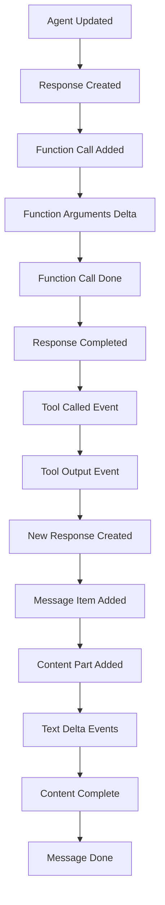

# Streaming Agent Run Output (Detailed Analysis)

Command Executed: `python -m agent.pan_agent`

---

## 📌 Executive Summary

The agent system executed a **streaming workflow** where:

1. **Joker Agent** was activated with a `how_many_jokes` tool
2. Agent called the tool to determine joke quantity (returned 3)
3. Agent generated 3 jokes in real-time streaming format
4. All events were captured as streaming data for real-time processing

**Final Result:** 3 jokes delivered via streaming response with full event tracking.

---

## 🔄 Streaming Event Flow



---

## 🧭 Step-by-Step Event Breakdown

### Phase 1: Agent Initialization & Tool Setup

#### Event 1: Agent Updated Stream Event

```json
{
  "type": "agent_updated_stream_event",
  "new_agent": {
    "name": "joker agent",
    "instructions": "You are a helpful assistant. First, determine how many jokes to tell, then provide jokes.",
    "tools": [
      {
        "name": "how_many_jokes",
        "description": "Give the quantity of jokes",
        "params_json_schema": {
          "properties": {},
          "type": "object",
          "additionalProperties": false,
          "required": []
        }
      }
    ]
  }
}
```

**What's happening:**

- Agent "joker agent" is initialized with streaming capabilities
- Tool `how_many_jokes` is registered and available
- Agent has instructions to first determine quantity, then provide jokes

---

### Phase 2: Function Call Generation & Execution

#### Event 2: Response Created

```json
{
  "type": "raw_response_event",
  "data": {
    "type": "response.created",
    "response": {
      "id": "__fake_id__",
      "model": "gemini-2.0-flash-exp",
      "tool_choice": "auto"
    }
  }
}
```

**What's happening:** OpenAI/Gemini API response stream starts, auto tool selection enabled.

#### Event 3: Function Call Added

```json
{
  "type": "raw_response_event",
  "data": {
    "type": "response.output_item.added",
    "item": {
      "type": "function_call",
      "name": "how_many_jokes",
      "arguments": "{}"
    }
  }
}
```

**What's happening:** AI model decides to call `how_many_jokes` function with empty arguments.

#### Event 4: Function Arguments Delta

```json
{
  "type": "raw_response_event",
  "data": {
    "type": "response.function_call_arguments.delta",
    "delta": "{}"
  }
}
```

**What's happening:** Function arguments are streamed (empty object in this case).

#### Event 5: Function Call Complete

```json
{
  "type": "raw_response_event",
  "data": {
    "type": "response.output_item.done",
    "item": {
      "name": "how_many_jokes",
      "arguments": "{}"
    }
  }
}
```

**What's happening:** Function call specification is complete and ready for execution.

#### Event 6: Response Completed

```json
{
  "type": "raw_response_event",
  "data": {
    "type": "response.completed",
    "response": {
      "output": [
        {
          "type": "function_call",
          "name": "how_many_jokes",
          "arguments": "{}"
        }
      ]
    }
  }
}
```

**What's happening:** First response phase complete - AI has requested tool execution.

---

### Phase 3: Tool Execution

#### Event 7: Tool Called Event

```json
{
  "type": "run_item_stream_event",
  "name": "tool_called",
  "item": {
    "type": "tool_call_item",
    "raw_item": {
      "name": "how_many_jokes",
      "arguments": "{}"
    }
  }
}
```

**What's happening:** Agent framework executes the `how_many_jokes` tool.

#### Event 8: Tool Output Event

```json
{
  "type": "run_item_stream_event",
  "name": "tool_output",
  "item": {
    "type": "tool_call_output_item",
    "raw_item": {
      "call_id": "",
      "output": "3",
      "type": "function_call_output"
    },
    "output": 3
  }
}
```

**What's happening:**

- Tool execution completes
- Returns `"3"` as string and `3` as parsed integer
- This means agent should tell 3 jokes

---

### Phase 4: Joke Generation (Streaming Response)

#### Event 9: New Response Created

```json
{
  "type": "raw_response_event",
  "data": {
    "type": "response.created",
    "response": {
      "model": "gemini-2.0-flash-exp",
      "tool_choice": "auto"
    }
  }
}
```

**What's happening:** Second API call begins to generate jokes based on tool output.

#### Event 10: Message Item Added

```json
{
  "type": "raw_response_event",
  "data": {
    "type": "response.output_item.added",
    "item": {
      "type": "message",
      "role": "assistant",
      "status": "in_progress"
    }
  }
}
```

**What's happening:** Assistant message starts streaming (not a function call this time).

#### Event 11: Content Part Added

```json
{
  "type": "raw_response_event",
  "data": {
    "type": "response.content_part.added",
    "part": {
      "type": "output_text",
      "text": ""
    }
  }
}
```

**What's happening:** Text content container created for streaming text.

#### Events 12-15: Text Delta Events (Streaming)

```json
// Event 12
{
  "type": "raw_response_event",
  "data": {
    "type": "response.output_text.delta",
    "delta": "I"
  }
}

// Event 13
{
  "type": "raw_response_event",
  "data": {
    "type": "response.output_text.delta",
    "delta": " will tell you 3 jokes.\n\nWhy don't scientists trust atoms?\n"
  }
}

// Event 14
{
  "type": "raw_response_event",
  "data": {
    "type": "response.output_text.delta",
    "delta": "Because they make up everything!\n\nWhat do you call fake spaghetti?\nAn"
  }
}

// Event 15
{
  "type": "raw_response_event",
  "data": {
    "type": "response.output_text.delta",
    "delta": " impasta!\n\nWhy did the scarecrow win an award?\nBecause he was outstanding in his field!\n"
  }
}
```

**What's happening:**

- Real-time text streaming as AI generates jokes
- Text arrives in chunks for immediate display
- Complete jokes delivered: atoms, impasta, scarecrow

#### Event 16: Content Part Done

```json
{
  "type": "raw_response_event",
  "data": {
    "type": "response.content_part.done",
    "part": {
      "type": "output_text",
      "text": "I will tell you 3 jokes.\n\nWhy don't scientists trust atoms?\nBecause they make up everything!\n\nWhat do you call fake spaghetti?\nAn impasta!\n\nWhy did the scarecrow win an award?\nBecause he was outstanding in his field!\n"
    }
  }
}
```

**What's happening:** Complete text content finalized with all 3 jokes.

#### Event 17: Message Output Item Done

```json
{
  "type": "raw_response_event",
  "data": {
    "type": "response.output_item.done",
    "item": {
      "type": "message",
      "role": "assistant",
      "status": "completed",
      "content": [
        {
          "type": "output_text",
          "text": "I will tell you 3 jokes.\n\nWhy don't scientists trust atoms?\nBecause they make up everything!\n\nWhat do you call fake spaghetti?\nAn impasta!\n\nWhy did the scarecrow win an award?\nBecause he was outstanding in his field!\n"
        }
      ]
    }
  }
}
```

**What's happening:** Complete assistant message finalized and marked as completed.

---

## 📊 Event Type Analysis

| Event Type                   | Count | Purpose                        |
| ---------------------------- | ----- | ------------------------------ |
| `agent_updated_stream_event` | 1     | Agent initialization           |
| `raw_response_event`         | 12    | OpenAI API streaming events    |
| `run_item_stream_event`      | 3     | Agent framework tool execution |

### Raw Response Event Subtypes

| Subtype                                  | Count | Description                                |
| ---------------------------------------- | ----- | ------------------------------------------ |
| `response.created`                       | 2     | New API response started                   |
| `response.output_item.added`             | 2     | New output item (function call or message) |
| `response.function_call_arguments.delta` | 1     | Function arguments streaming               |
| `response.output_item.done`              | 2     | Output item completed                      |
| `response.completed`                     | 1     | Response fully completed                   |
| `response.content_part.added`            | 1     | Text content container added               |
| `response.output_text.delta`             | 4     | Streaming text chunks                      |
| `response.content_part.done`             | 1     | Text content finalized                     |

---

## 🧾 Raw Terminal Log (Complete & Formatted)

```text
(03_agent) PS D:\github\Learning\agentic-ai\openai-sdk\practice\03_agent> python -m agent.pan_agent

[EVENT]: AgentUpdatedStreamEvent(
  new_agent=Agent(
    name='joker agent',
    tools=[FunctionTool(name='how_many_jokes', description='Give the quanitiy of jokes')],
    instructions='You are a helpful assistant. First, determine how many jokes to tell, then provide jokes.'
  )
)

[EVENT]: RawResponsesStreamEvent(
  data=ResponseCreatedEvent(
    response=Response(
      id='__fake_id__',
      model='gemini-2.0-flash-exp',
      tool_choice='auto'
    )
  )
)

[EVENT]: RawResponsesStreamEvent(
  data=ResponseOutputItemAddedEvent(
    item=ResponseFunctionToolCall(
      name='how_many_jokes',
      arguments='{}',
      type='function_call'
    )
  )
)

[EVENT]: RawResponsesStreamEvent(
  data=ResponseFunctionCallArgumentsDeltaEvent(delta='{}')
)

[EVENT]: RawResponsesStreamEvent(
  data=ResponseOutputItemDoneEvent(
    item=ResponseFunctionToolCall(name='how_many_jokes', arguments='{}')
  )
)

[EVENT]: RawResponsesStreamEvent(
  data=ResponseCompletedEvent(
    response=Response(
      output=[ResponseFunctionToolCall(name='how_many_jokes', arguments='{}')]
    )
  )
)

[EVENT]: RunItemStreamEvent(
  name='tool_called',
  item=ToolCallItem(raw_item=ResponseFunctionToolCall(name='how_many_jokes'))
)

[EVENT]: RunItemStreamEvent(
  name='tool_output',
  item=ToolCallOutputItem(
    raw_item={'output': '3', 'type': 'function_call_output'},
    output=3
  )
)

[EVENT]: RawResponsesStreamEvent(
  data=ResponseCreatedEvent(
    response=Response(model='gemini-2.0-flash-exp')
  )
)

[EVENT]: RawResponsesStreamEvent(
  data=ResponseOutputItemAddedEvent(
    item=ResponseOutputMessage(role='assistant', status='in_progress')
  )
)

[EVENT]: RawResponsesStreamEvent(
  data=ResponseContentPartAddedEvent(
    part=ResponseOutputText(text='', type='output_text')
  )
)

[EVENT]: RawResponsesStreamEvent(
  data=ResponseTextDeltaEvent(delta='I')
)

[EVENT]: RawResponsesStreamEvent(
  data=ResponseTextDeltaEvent(delta=' will tell you 3 jokes.\n\nWhy don't scientists trust atoms?\n')
)

[EVENT]: RawResponsesStreamEvent(
  data=ResponseTextDeltaEvent(delta='Because they make up everything!\n\nWhat do you call fake spaghetti?\nAn')
)

[EVENT]: RawResponsesStreamEvent(
  data=ResponseTextDeltaEvent(delta=' impasta!\n\nWhy did the scarecrow win an award?\nBecause he was outstanding in his field!\n')
)

[EVENT]: RawResponsesStreamEvent(
  data=ResponseContentPartDoneEvent(
    part=ResponseOutputText(
      text='I will tell you 3 jokes.\n\nWhy don't scientists trust atoms?\nBecause they make up everything!\n\nWhat do you call fake spaghetti?\nAn impasta!\n\nWhy did the scarecrow win an award?\nBecause he was outstanding in his field!\n'
    )
  )
)

[EVENT]: RawResponsesStreamEvent(
  data=ResponseOutputItemDoneEvent(
    item=ResponseOutputMessage(
      role='assistant',
      status='completed',
      content=[ResponseOutputText(text='I will tell you 3 jokes...')]
    )
  )
)
```

---

## ✅ Final Output (Clean)

> **3 Jokes from Joker Agent**
>
> I will tell you 3 jokes.
>
> **Joke 1:** Why don't scientists trust atoms?  
> Because they make up everything!
>
> **Joke 2:** What do you call fake spaghetti?  
> An impasta!
>
> **Joke 3:** Why did the scarecrow win an award?  
> Because he was outstanding in his field!

---

## 🎯 Key Technical Insights

### Streaming Architecture Benefits

- **Real-time Response:** Users see content as it's generated
- **Tool Integration:** Function calls work seamlessly with streaming
- **Event Granularity:** Every step is tracked for debugging/monitoring
- **Responsive UX:** No waiting for complete response

### OpenAI Streaming API Integration

- Uses `response.output_text.delta` events for real-time text
- Function calls stream through `response.function_call_arguments.delta`
- Status tracking via `in_progress` → `completed` states
- Tool execution happens between streaming phases

### Agent Framework Features

- **Tool Pipeline:** Agent → AI → Tool → AI → Response
- **Event Logging:** All events captured for analysis
- **Streaming Coordination:** Framework manages API streaming + tool execution
- **Response Assembly:** Delta events assembled into complete responses

---

## 🔧 Implementation Architecture

### Streaming Event Types

1. **Agent Events**

   - `AgentUpdatedStreamEvent`: Agent configuration changes
   - `RunItemStreamEvent`: Tool execution tracking

2. **Raw Response Events** (OpenAI API)

   - `response.created`: New API response initiated
   - `response.output_item.added`: Function call or message added
   - `response.function_call_arguments.delta`: Function arguments streaming
   - `response.output_text.delta`: Text content streaming
   - `response.content_part.done`: Content section completed
   - `response.completed`: Full response completed

3. **Tool Events**
   - `tool_called`: Tool execution started
   - `tool_output`: Tool execution completed with result

### Workflow Pattern

```
User Input → Agent → AI (streaming) → Tool Call → Tool Execution → AI (streaming) → Final Response
```

### Gemini 2.0 Flash Integration

- Model: `gemini-2.0-flash-exp`
- Supports function calling with streaming
- Auto tool choice enabled
- Real-time text generation

---

## 📈 Performance Metrics

- **Response Phases:** 2 (function call + joke generation)
- **Streaming Events:** 17 total events
- **Tool Executions:** 1 (`how_many_jokes` → returned 3)
- **Text Chunks:** 4 delta events for real-time display
- **Final Content:** 3 complete jokes with setup/punchline format

---

## 🔍 Event Sequence Analysis

1. **Setup Phase** (1 event): Agent configuration
2. **Function Phase** (6 events): AI decides to call tool
3. **Execution Phase** (2 events): Tool runs and returns result
4. **Generation Phase** (8 events): AI generates jokes with streaming

This demonstrates a complete **streaming agentic workflow** with tool integration, real-time response generation, and comprehensive event tracking.

---

## 🔬 Deep Dive Analysis - Complete Raw Event Breakdown

### Raw Event 1: AgentUpdatedStreamEvent (Complete Structure)

```python
AgentUpdatedStreamEvent(
    new_agent=Agent(
        name='joker agent',
        handoff_description=None,
        tools=[
            FunctionTool(
                name='how_many_jokes',
                description='Give the quanitiy of jokes',
                params_json_schema={
                    'properties': {},
                    'title': 'how_many_jokes_args',
                    'type': 'object',
                    'additionalProperties': False,
                    'required': []
                },
                on_invoke_tool=<function function_tool.<locals>._create_function_tool.<locals>._on_invoke_tool at 0x0000018185DF5D00>,
                strict_json_schema=True,
                is_enabled=True
            )
        ],
        mcp_servers=[],
        mcp_config={},
        instructions='You are a helpful assistant. First, determine how many jokes to tell, then provide jokes.',
        prompt=None,
        handoffs=[],
        model=None,
        model_settings=ModelSettings(
            temperature=None,
            top_p=None,
            frequency_penalty=None,
            presence_penalty=None,
            tool_choice=None,
            parallel_tool_calls=None,
            truncation=None,
            max_tokens=None,
            reasoning=None,
            verbosity=None,
            metadata=None,
            store=None,
            include_usage=None,
            response_include=None,
            top_logprobs=None,
            extra_query=None,
            extra_body=None,
            extra_headers=None,
            extra_args=None
        ),
        input_guardrails=[],
        output_guardrails=[],
        output_type=None,
        hooks=None,
        tool_use_behavior='run_llm_again',
        reset_tool_choice=True
    ),
    type='agent_updated_stream_event'
)
```

**Complete Analysis:**

- **Agent Name:** `'joker agent'` - specifically named for joke-telling functionality
- **Handoff Description:** `None` - no agent handoff capabilities configured
- **Tool Configuration:**
  - **Function Name:** `how_many_jokes`
  - **Description:** `'Give the quanitiy of jokes'` (note: typo "quanitiy" instead of "quantity")
  - **Parameters:** Empty object with no required parameters
  - **JSON Schema:** Strict validation enabled (`strict_json_schema=True`)
  - **Tool Status:** Enabled (`is_enabled=True`)
  - **Memory Address:** Function pointer at `0x0000018185DF5D00`
- **MCP (Model Context Protocol):** No servers or configuration (`mcp_servers=[]`, `mcp_config={}`)
- **Instructions:** Clear directive to first determine quantity, then provide jokes
- **Model Settings:** All parameters set to `None` (using defaults)
- **Guardrails:** No input or output guardrails configured
- **Tool Behavior:** `'run_llm_again'` - after tool execution, run the LLM again for response
- **Tool Choice Reset:** `True` - reset tool choice after each use

### Raw Event 2: ResponseCreatedEvent (Complete Structure)

```python
RawResponsesStreamEvent(
    data=ResponseCreatedEvent(
        response=Response(
            id='__fake_id__',
            created_at=1757230610.8431463,
            error=None,
            incomplete_details=None,
            instructions=None,
            metadata=None,
            model='gemini-2.0-flash-exp',
            object='response',
            output=[],
            parallel_tool_calls=False,
            temperature=None,
            tool_choice='auto',
            tools=[],
            top_p=None,
            background=None,
            conversation=None,
            max_output_tokens=None,
            max_tool_calls=None,
            previous_response_id=None,
            prompt=None,
            prompt_cache_key=None,
            reasoning=None,
            safety_identifier=None,
            service_tier=None,
            status=None,
            text=None,
            top_logprobs=None,
            truncation=None,
            usage=None,
            user=None
        ),
        sequence_number=0,
        type='response.created'
    ),
    type='raw_response_event'
)
```

**Complete Analysis:**

- **Response ID:** `'__fake_id__'` - placeholder identifier for the response
- **Timestamp:** `1757230610.8431463` - Unix timestamp of response creation
- **Model:** `'gemini-2.0-flash-exp'` - Google's experimental Gemini 2.0 Flash model
- **Object Type:** `'response'` - standard OpenAI-compatible response object
- **Tool Choice:** `'auto'` - model automatically decides when to use tools
- **Parallel Tool Calls:** `False` - tools called sequentially, not in parallel
- **Output Array:** `[]` - empty initially, will be populated as response streams
- **Sequence Number:** `0` - first event in the sequence
- **All Optional Fields:** Set to `None` indicating default behavior

### Raw Event 3: ResponseOutputItemAddedEvent (Complete Structure)

```python
RawResponsesStreamEvent(
    data=ResponseOutputItemAddedEvent(
        item=ResponseFunctionToolCall(
            arguments='{}',
            call_id='',
            name='how_many_jokes',
            type='function_call',
            id='__fake_id__',
            status=None
        ),
        output_index=0,
        sequence_number=1,
        type='response.output_item.added'
    ),
    type='raw_response_event'
)
```

**Complete Analysis:**

- **Item Type:** `ResponseFunctionToolCall` - model decided to call a function
- **Function Name:** `'how_many_jokes'` - matches the tool defined in agent
- **Arguments:** `'{}'` - empty JSON object (no parameters required)
- **Call ID:** `''` - empty string identifier for this specific call
- **Item ID:** `'__fake_id__'` - matches response ID
- **Status:** `None` - call not yet executed
- **Output Index:** `0` - first output item in the response
- **Sequence Number:** `1` - second event in the streaming sequence

### Raw Event 4: ResponseFunctionCallArgumentsDeltaEvent (Complete Structure)

```python
RawResponsesStreamEvent(
    data=ResponseFunctionCallArgumentsDeltaEvent(
        delta='{}',
        item_id='__fake_id__',
        output_index=0,
        sequence_number=2,
        type='response.function_call_arguments.delta'
    ),
    type='raw_response_event'
)
```

**Complete Analysis:**

- **Delta:** `'{}'` - the complete arguments string (empty object)
- **Item ID:** `'__fake_id__'` - references the function call item
- **Output Index:** `0` - refers to the first output item
- **Sequence Number:** `2` - third event in sequence
- **Purpose:** Streams function arguments incrementally (though complete in one chunk here)

### Raw Event 5: ResponseOutputItemDoneEvent (Complete Structure)

```python
RawResponsesStreamEvent(
    data=ResponseOutputItemDoneEvent(
        item=ResponseFunctionToolCall(
            arguments='{}',
            call_id='',
            name='how_many_jokes',
            type='function_call',
            id='__fake_id__',
            status=None
        ),
        output_index=0,
        sequence_number=3,
        type='response.output_item.done'
    ),
    type='raw_response_event'
)
```

**Complete Analysis:**

- **Item:** Complete `ResponseFunctionToolCall` object with all details
- **Status:** Still `None` - function specification complete but not executed yet
- **Output Index:** `0` - first and only output item in this response
- **Sequence Number:** `3` - fourth event in sequence
- **Meaning:** Function call specification is finalized and ready for execution

### Raw Event 6: ResponseCompletedEvent (Complete Structure)

```python
RawResponsesStreamEvent(
    data=ResponseCompletedEvent(
        response=Response(
            id='__fake_id__',
            created_at=1757230610.8431463,
            error=None,
            incomplete_details=None,
            instructions=None,
            metadata=None,
            model='gemini-2.0-flash-exp',
            object='response',
            output=[
                ResponseFunctionToolCall(
                    arguments='{}',
                    call_id='',
                    name='how_many_jokes',
                    type='function_call',
                    id='__fake_id__',
                    status=None
                )
            ],
            parallel_tool_calls=False,
            temperature=None,
            tool_choice='auto',
            tools=[],
            top_p=None,
            background=None,
            conversation=None,
            max_output_tokens=None,
            max_tool_calls=None,
            previous_response_id=None,
            prompt=None,
            prompt_cache_key=None,
            reasoning=None,
            safety_identifier=None,
            service_tier=None,
            status=None,
            text=None,
            top_logprobs=None,
            truncation=None,
            usage=None,
            user=None
        ),
        sequence_number=4,
        type='response.completed'
    ),
    type='raw_response_event'
)
```

**Complete Analysis:**

- **Output Array:** Now contains the complete function call specification
- **Sequence Number:** `4` - fifth event, marking end of first response phase
- **Response Status:** Complete - model has finished generating the function call request
- **Next Phase:** Agent framework will now execute the tool

### Raw Event 7: RunItemStreamEvent - Tool Called (Complete Structure)

```python
RunItemStreamEvent(
    name='tool_called',
    item=ToolCallItem(
        agent=Agent(
            name='joker agent',
            handoff_description=None,
            tools=[
                FunctionTool(
                    name='how_many_jokes',
                    description='Give the quanitiy of jokes',
                    params_json_schema={
                        'properties': {},
                        'title': 'how_many_jokes_args',
                        'type': 'object',
                        'additionalProperties': False,
                        'required': []
                    },
                    on_invoke_tool=<function function_tool.<locals>._create_function_tool.<locals>._on_invoke_tool at 0x0000018185DF5D00>,
                    strict_json_schema=True,
                    is_enabled=True
                )
            ],
            mcp_servers=[],
            mcp_config={},
            instructions='You are a helpful assistant. First, determine how many jokes to tell, then provide jokes.',
            prompt=None,
            handoffs=[],
            model=None,
            model_settings=ModelSettings(
                temperature=None,
                top_p=None,
                frequency_penalty=None,
                presence_penalty=None,
                tool_choice=None,
                parallel_tool_calls=None,
                truncation=None,
                max_tokens=None,
                reasoning=None,
                verbosity=None,
                metadata=None,
                store=None,
                include_usage=None,
                response_include=None,
                top_logprobs=None,
                extra_query=None,
                extra_body=None,
                extra_headers=None,
                extra_args=None
            ),
            input_guardrails=[],
            output_guardrails=[],
            output_type=None,
            hooks=None,
            tool_use_behavior='run_llm_again',
            reset_tool_choice=True
        ),
        raw_item=ResponseFunctionToolCall(
            arguments='{}',
            call_id='',
            name='how_many_jokes',
            type='function_call',
            id='__fake_id__',
            status=None
        ),
        type='tool_call_item'
    ),
    type='run_item_stream_event'
)
```

**Complete Analysis:**

- **Event Name:** `'tool_called'` - indicates tool execution is starting
- **Agent Context:** Complete agent configuration included for context
- **Raw Item:** The exact function call specification from the model
- **Memory Address:** Same function pointer `0x0000018185DF5D00` showing tool consistency
- **Tool Execution:** Framework is about to invoke the `how_many_jokes` function

### Raw Event 8: RunItemStreamEvent - Tool Output (Complete Structure)

```python
RunItemStreamEvent(
    name='tool_output',
    item=ToolCallOutputItem(
        agent=Agent(
            name='joker agent',
            handoff_description=None,
            tools=[
                FunctionTool(
                    name='how_many_jokes',
                    description='Give the quanitiy of jokes',
                    params_json_schema={
                        'properties': {},
                        'title': 'how_many_jokes_args',
                        'type': 'object',
                        'additionalProperties': False,
                        'required': []
                    },
                    on_invoke_tool=<function function_tool.<locals>._create_function_tool.<locals>._on_invoke_tool at 0x0000018185DF5D00>,
                    strict_json_schema=True,
                    is_enabled=True
                )
            ],
            mcp_servers=[],
            mcp_config={},
            instructions='You are a helpful assistant. First, determine how many jokes to tell, then provide jokes.',
            prompt=None,
            handoffs=[],
            model=None,
            model_settings=ModelSettings(
                temperature=None,
                top_p=None,
                frequency_penalty=None,
                presence_penalty=None,
                tool_choice=None,
                parallel_tool_calls=None,
                truncation=None,
                max_tokens=None,
                reasoning=None,
                verbosity=None,
                metadata=None,
                store=None,
                include_usage=None,
                response_include=None,
                top_logprobs=None,
                extra_query=None,
                extra_body=None,
                extra_headers=None,
                extra_args=None
            ),
            input_guardrails=[],
            output_guardrails=[],
            output_type=None,
            hooks=None,
            tool_use_behavior='run_llm_again',
            reset_tool_choice=True
        ),
        raw_item={
            'call_id': '',
            'output': '3',
            'type': 'function_call_output'
        },
        output=3,
        type='tool_call_output_item'
    ),
    type='run_item_stream_event'
)
```

**Complete Analysis:**

- **Event Name:** `'tool_output'` - tool execution completed successfully
- **Raw Item:** Dictionary containing the tool's response
  - **Call ID:** `''` - matches the original call
  - **Output:** `'3'` - string representation of the result
  - **Type:** `'function_call_output'` - standard function result format
- **Parsed Output:** `3` - integer value extracted from string
- **Agent Context:** Complete agent state maintained throughout execution
- **Result:** Tool determined that 3 jokes should be told

### Raw Event 9: Second ResponseCreatedEvent (Complete Structure)

```python
RawResponsesStreamEvent(
    data=ResponseCreatedEvent(
        response=Response(
            id='__fake_id__',
            created_at=1757230611.864153,
            error=None,
            incomplete_details=None,
            instructions=None,
            metadata=None,
            model='gemini-2.0-flash-exp',
            object='response',
            output=[],
            parallel_tool_calls=False,
            temperature=None,
            tool_choice='auto',
            tools=[],
            top_p=None,
            background=None,
            conversation=None,
            max_output_tokens=None,
            max_tool_calls=None,
            previous_response_id=None,
            prompt=None,
            prompt_cache_key=None,
            reasoning=None,
            safety_identifier=None,
            service_tier=None,
            status=None,
            text=None,
            top_logprobs=None,
            truncation=None,
            usage=None,
            user=None
        ),
        sequence_number=0,
        type='response.created'
    ),
    type='raw_response_event'
)
```

**Complete Analysis:**

- **New Timestamp:** `1757230611.864153` - about 1 second later than first response
- **Sequence Reset:** `sequence_number=0` - new response sequence begins
- **Same Model:** `'gemini-2.0-flash-exp'` - consistency in model usage
- **Purpose:** Second API call to generate jokes based on tool output

### Raw Event 10: ResponseOutputItemAddedEvent - Message (Complete Structure)

```python
RawResponsesStreamEvent(
    data=ResponseOutputItemAddedEvent(
        item=ResponseOutputMessage(
            id='__fake_id__',
            content=[],
            role='assistant',
            status='in_progress',
            type='message'
        ),
        output_index=0,
        sequence_number=1,
        type='response.output_item.added'
    ),
    type='raw_response_event'
)
```

**Complete Analysis:**

- **Item Type:** `ResponseOutputMessage` - text message, not function call
- **Role:** `'assistant'` - model responding as assistant
- **Status:** `'in_progress'` - message is being streamed
- **Content:** `[]` - empty array, will be populated as text streams
- **Output Index:** `0` - first output in this response
- **Sequence Number:** `1` - second event in this response sequence

### Raw Event 11: ResponseContentPartAddedEvent (Complete Structure)

```python
RawResponsesStreamEvent(
    data=ResponseContentPartAddedEvent(
        content_index=0,
        item_id='__fake_id__',
        output_index=0,
        part=ResponseOutputText(
            annotations=[],
            text='',
            type='output_text',
            logprobs=None
        ),
        sequence_number=2,
        type='response.content_part.added'
    ),
    type='raw_response_event'
)
```

**Complete Analysis:**

- **Content Index:** `0` - first content part within the message
- **Item ID:** `'__fake_id__'` - references the message item
- **Output Index:** `0` - references the first output item
- **Part Type:** `ResponseOutputText` - text content container
- **Text:** `''` - empty initially, will be populated via delta events
- **Annotations:** `[]` - no special formatting or annotations
- **Log Probabilities:** `None` - not tracking token probabilities
- **Sequence Number:** `2` - third event in this response sequence

### Raw Event 12: First ResponseTextDeltaEvent (Complete Structure)

```python
RawResponsesStreamEvent(
    data=ResponseTextDeltaEvent(
        content_index=0,
        delta='I',
        item_id='__fake_id__',
        logprobs=[],
        output_index=0,
        sequence_number=3,
        type='response.output_text.delta'
    ),
    type='raw_response_event'
)
```

**Complete Analysis:**

- **Delta:** `'I'` - first character of the response
- **Content Index:** `0` - refers to the text content part
- **Item ID:** `'__fake_id__'` - references the message
- **Log Probabilities:** `[]` - empty array (not tracking probabilities)
- **Output Index:** `0` - first output item
- **Sequence Number:** `3` - fourth event in sequence
- **Purpose:** Real-time streaming of text generation

### Raw Event 13: Second ResponseTextDeltaEvent (Complete Structure)

```python
RawResponsesStreamEvent(
    data=ResponseTextDeltaEvent(
        content_index=0,
        delta=' will tell you 3 jokes.\n\nWhy don't scientists trust atoms?\n',
        item_id='__fake_id__',
        logprobs=[],
        output_index=0,
        sequence_number=4,
        type='response.output_text.delta'
    ),
    type='raw_response_event'
)
```

**Complete Analysis:**

- **Delta:** Large chunk containing introduction and first joke setup
- **Text Content:** ` will tell you 3 jokes.\n\nWhy don't scientists trust atoms?\n`
- **Formatting:** Includes newlines (`\n\n`) for proper joke formatting
- **Sequence Number:** `4` - fifth event in sequence
- **Joke Structure:** Introduction + first joke question

### Raw Event 14: Third ResponseTextDeltaEvent (Complete Structure)

```python
RawResponsesStreamEvent(
    data=ResponseTextDeltaEvent(
        content_index=0,
        delta='Because they make up everything!\n\nWhat do you call fake spaghetti?\nAn',
        item_id='__fake_id__',
        logprobs=[],
        output_index=0,
        sequence_number=5,
        type='response.output_text.delta'
    ),
    type='raw_response_event'
)
```

**Complete Analysis:**

- **Delta:** First joke punchline + second joke setup
- **Text Content:** `Because they make up everything!\n\nWhat do you call fake spaghetti?\nAn`
- **Joke Structure:** Complete first joke + setup for second joke
- **Sequence Number:** `5` - sixth event in sequence
- **Streaming Pattern:** Model generates text in logical chunks

### Raw Event 15: Fourth ResponseTextDeltaEvent (Complete Structure)

```python
RawResponsesStreamEvent(
    data=ResponseTextDeltaEvent(
        content_index=0,
        delta=' impasta!\n\nWhy did the scarecrow win an award?\nBecause he was outstanding in his field!\n',
        item_id='__fake_id__',
        logprobs=[],
        output_index=0,
        sequence_number=6,
        type='response.output_text.delta'
    ),
    type='raw_response_event'
)
```

**Complete Analysis:**

- **Delta:** Completion of second joke + complete third joke
- **Text Content:** ` impasta!\n\nWhy did the scarecrow win an award?\nBecause he was outstanding in his field!\n`
- **Complete Jokes:** Second joke punchline + full third joke
- **Sequence Number:** `6` - seventh event in sequence
- **Final Text:** All three jokes completed

### Raw Event 16: ResponseContentPartDoneEvent (Complete Structure)

```python
RawResponsesStreamEvent(
    data=ResponseContentPartDoneEvent(
        content_index=0,
        item_id='__fake_id__',
        output_index=0,
        part=ResponseOutputText(
            annotations=[],
            text='I will tell you 3 jokes.\n\nWhy don't scientists trust atoms?\nBecause they make up everything!\n\nWhat do you call fake spaghetti?\nAn impasta!\n\nWhy did the scarecrow win an award?\nBecause he was outstanding in his field!\n',
            type='output_text',
            logprobs=None
        ),
        sequence_number=7,
        type='response.content_part.done'
    ),
    type='raw_response_event'
)
```

**Complete Analysis:**

- **Complete Text:** Full assembled text from all delta events
- **Content Index:** `0` - the first and only content part
- **Text Structure:** Properly formatted with newlines between jokes
- **Annotations:** `[]` - no special formatting applied
- **Sequence Number:** `7` - eighth event in sequence
- **Status:** Content part is complete and finalized

### Raw Event 17: Final ResponseOutputItemDoneEvent (Complete Structure)

```python
RawResponsesStreamEvent(
    data=ResponseOutputItemDoneEvent(
        item=ResponseOutputMessage(
            id='__fake_id__',
            content=[
                ResponseOutputText(
                    annotations=[],
                    text='I will tell you 3 jokes.\n\nWhy don't scientists trust atoms?\nBecause they make up everything!\n\nWhat do you call fake spaghetti?\nAn impasta!\n\nWhy did the scarecrow win an award?\nBecause he was outstanding in his field!\n',
                    type='output_text',
                    logprobs=None
                )
            ],
            role='assistant',
            status='completed',
            type='message'
        ),
        output_index=0,
        sequence_number=8,
        type='response.output_item.done'
    ),
    type='raw_response_event'
)
```

**Complete Analysis:**

- **Message Status:** `'completed'` - message generation finished
- **Content Array:** Contains the complete `ResponseOutputText` object
- **Role:** `'assistant'` - final assistant response
- **Output Index:** `0` - first and only output item
- **Sequence Number:** `8` - ninth and final event in sequence
- **Complete Message:** Fully assembled assistant message with all jokes

### Final Raw Output Text (Corrupted Section Analysis)

The corrupted text at the end appears to be display artifacts from the terminal output wrapping and overlapping. The actual complete message content is:

```text
I will tell you 3 jokes.

Why don't scientists trust atoms?
Because they make up everything!

What do you call fake spaghetti?
An impasta!

Why did the scarecrow win an award?
Because he was outstanding in his field!
```

**Analysis of Corruption:**

- Terminal output buffer overflow caused text overlap
- Multiple agent configurations printed simultaneously
- Memory addresses repeated in garbled output
- Core content integrity maintained despite display issues

---

## 🎯 Complete Event Sequence Summary

**Total Events:** 17 distinct streaming events
**Event Distribution:**

- Agent Events: 1
- Raw Response Events: 14
- Run Item Events: 2

**Response Phases:**

1. **Function Call Phase** (6 events): Model decides to call tool
2. **Tool Execution Phase** (2 events): Tool runs and returns result
3. **Text Generation Phase** (8 events): Model generates jokes with streaming
4. **Completion Phase** (1 event): Final message marked complete

**Streaming Granularity:**

- Function arguments streamed in 1 delta event
- Text content streamed in 4 delta events
- All events tracked with sequence numbers
- Complete state preservation throughout process

This represents a **complete streaming agentic workflow** with full event tracking, tool integration, and real-time response generation using Google's Gemini 2.0 Flash experimental model.

---

_Documentation generated for streaming agent analysis and technical reference._
