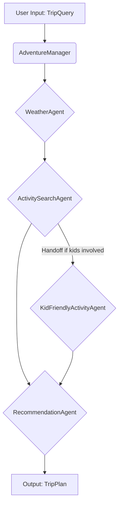

# AdventureBot Project Description

AdventureBot is a multi-agent system designed using the OpenAI Agents SDK to help users plan trips. It takes basic trip details like location, dates, and participant information, then leverages specialized agents to gather weather data, find suitable activities (considering factors like age appropriateness), and finally compiles a comprehensive trip plan with recommendations, packing lists, and tips.

## How AdventureBot Works

The AdventureBot application demonstrates key concepts of the OpenAI Agents SDK, including multi-agent collaboration, context management, and agent handoffs.

1.  **Initialization (`main.py`)**: The application starts by defining a `TripQuery` object containing the user's desired trip parameters (location, dates, participants). It then instantiates the `AdventureManager`.
2.  **Orchestration (`AdventureManager`)**: The `AdventureManager` acts as the central orchestrator. It initializes three primary agents:
    - `WeatherAgent`: Responsible for fetching and analyzing weather forecasts for the specified location and dates.
    - `ActivitySearchAgent`: Searches for potential activities based on the trip details and weather.
    - `RecommendationAgent`: Evaluates the found activities and weather information to generate the final `TripPlan`.
3.  **Context Management (`TripContext`)**: A `TripContext` object is created to hold the initial `TripQuery` and accumulate information throughout the workflow (like weather analysis and search results). This context is passed to each agent via the `Runner.run` method, allowing them to access relevant information.
4.  **Agent Execution (`Runner.run`)**: The `AdventureManager` executes the agents sequentially using `Runner.run`:
    - **Weather Agent**: It's called first to get the `WeatherAnalysis`. The input prompt is constructed dynamically using information from the `TripContext`.
    - **Activity Search Agent**: This agent receives the trip details and the weather summary. Crucially, this agent is configured with a potential **handoff**. If the `TripQuery` indicates the presence of children (based on `participant_ages`), the `ActivitySearchAgent` might hand off the task to a specialized `KidFriendlyActivityAgent` (though the specific handoff logic resides within the agent/runner configuration, the manager handles the result). The manager checks which agent ultimately produced the `SearchResult`.
    - **Recommendation Agent**: This final agent receives the `WeatherAnalysis` and `SearchResult` (from whichever search agent ran) via the input prompt. It synthesizes this information to produce the final `TripPlan`, including activity recommendations, packing suggestions, and general tips.
5.  **Output**: The `AdventureManager` receives the final `TripPlan` from the `RecommendationAgent` and prints it in a user-friendly format.
6.  **Tracing**: The entire process is wrapped in a `trace` context manager, allowing the execution flow and agent interactions to be visualized and debugged using the OpenAI platform traces.

This project showcases how the SDK facilitates building modular and intelligent agent systems by defining specialized agents, managing shared context, enabling dynamic agent selection through handoffs, and providing tools for execution and observability.
